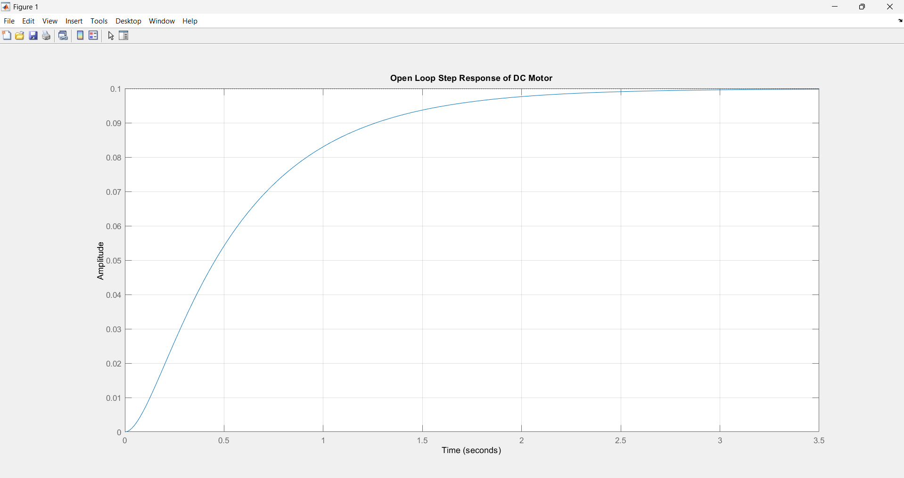
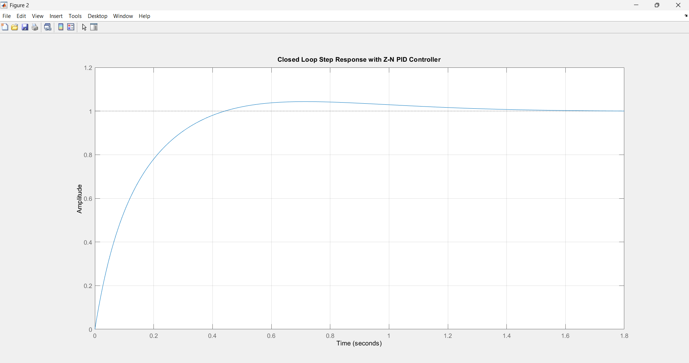
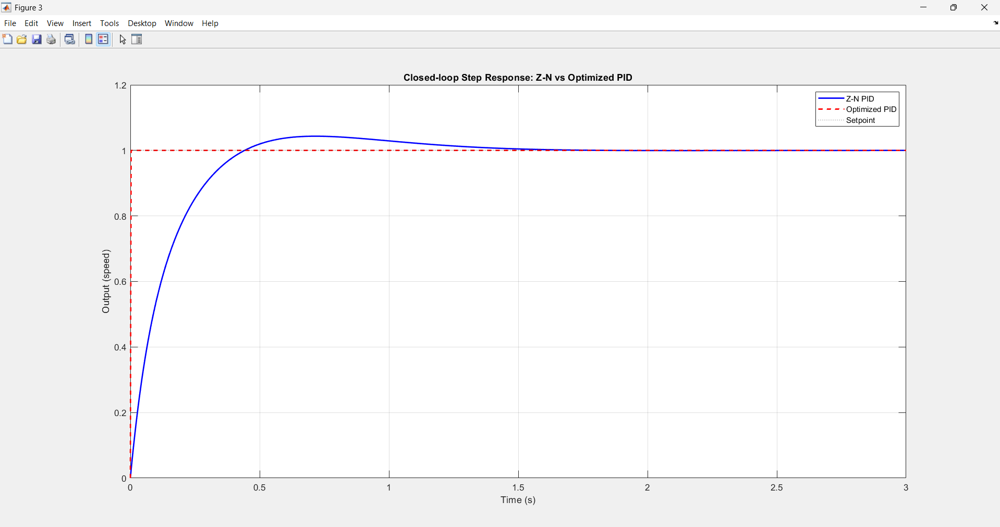
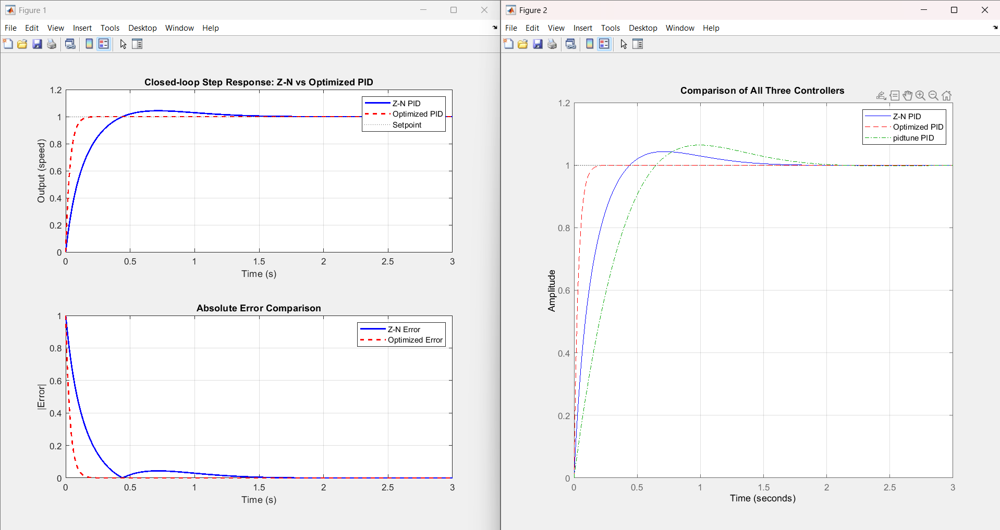

<div align="center">

# ⚙️ dc-motor-pid-itae-optimizer

**ITAE-Optimized PID Tuning for DC Motor Speed Control**

*Ziegler–Nichols baseline → fmincon constrained optimization → 77.65% ITAE improvement*

[](https://www.mathworks.com/)
[](https://www.mathworks.com/products/control.html)
[](https://www.mathworks.com/products/optimization.html)
[](LICENSE)
[](https://iiitn.ac.in/)

</div>

---

## 📖 Overview

This project implements and compares three PID controller tuning strategies for **armature-controlled DC motor speed regulation**. Starting from the classical Ziegler–Nichols method as a baseline, the controller gains are refined using MATLAB's `fmincon` constrained optimizer to minimize the **ITAE** (Integral of Time-weighted Absolute Error) performance index.

The result: **zero overshoot**, **4× faster rise time**, and **8.7× faster settling** compared to the Z–N baseline.

> 📄 Full research paper available in [`report/`](report/)

---

## 🏆 Results at a Glance

| Controller | Rise Time (s) | Settling Time (s) | Overshoot (%) | ITAE Value |
|:---|:---:|:---:|:---:|:---:|
| Z–N PID | 0.2788 | 1.1356 | 4.34 | 0.004491 |
| pidtune PID | 0.4604 | 1.6039 | 6.39 | 0.100177 |
| **Optimized PID ✅** | **0.0734** | **0.1299** | **0.00** | **0.001347** |

> **77.65% improvement** in ITAE value over the Z–N baseline.

---

## 📁 Repository Structure

```
PIRP/
├── code/
│   ├── dc_motor_pid_zn_simulation.m          # Motor TF + Z–N tuning + open/closed-loop plots
│   └── pid_optimization_itae_dc_motor_fmincon.m  # fmincon ITAE optimization + all comparisons
├── report/
│   └── ITAE-Based_Optimization_of_PID_Controller...pdf   # Full research paper
├── results/
│   ├── dc_motor_pid_zn_simulation/
│   │   ├── open_loop_step_response.png
│   │   ├── close_loop_step_response.png
│   │   └── Z-N_vs_optimized_pid.png
│   └── pid_optimization_itae_dc_motor_fmincon/
│       └── pid_controller_comparison_step_response.png
├── .vbcignore
└── README.md
```

---

## 🧮 Motor Model

The armature-controlled DC motor is modeled as a **second-order transfer function** derived from coupled electrical (KVL) and mechanical (Newton's law) equations:

$$\frac{\Omega(s)}{V_a(s)} = \frac{K_t}{(LJ)s^2 + (LB + RJ)s + (RB + K_t K_e)}$$

### Model Parameters

| Parameter | Symbol | Value |
|:---|:---:|:---:|
| Armature Resistance | R | 1 Ω |
| Armature Inductance | L | 0.5 H |
| Motor Inertia | J | 0.01 kg·m² |
| Friction Coefficient | B | 0.1 N·m·s/rad |
| Torque Constant | Kₜ | 0.01 N·m/A |
| Back EMF Constant | Kₑ | 0.01 V·s/rad |

Substituting these values yields:

$$G(s) = \frac{0.01}{0.005s^2 + 0.06s + 0.1001}$$

---

## 🔧 Tuning Pipeline

### Step 1 — Ziegler–Nichols Baseline

```matlab
Ku = 70;   Pu = 0.8;
Kp = 0.6 * Ku;        % → 42
Ki = 2 * Kp / Pu;     % → 105
Kd = Kp * Pu / 8;     % → 4.2
```

### Step 2 — ITAE-Based fmincon Optimization

The ITAE index penalizes errors that **persist over time**, driving the optimizer toward faster, smoother responses:

$$J = \int_0^{\infty} t \cdot |e(t)| \, dt$$

```matlab
% Objective: minimize ITAE with stability + overshoot penalties
obj = @(x) pid_itae_obj(x, G, t);
x0  = [Kp, Ki, Kd];          % Z-N as starting point
lb  = [0.1,   0.1,  0.01];
ub  = [200,   300,  50  ];

[x_opt, ~] = fmincon(obj, x0, [], [], [], [], lb, ub, [], opts);
% → Kp = 179.6338,  Ki = 299.9457,  Kd = 14.9032
```

The objective function includes:
- **ITAE** as the primary cost
- Penalty for overshoot > 15%
- Penalty for settling time > 2 s
- Small control effort penalty

---

## 🚀 Getting Started

### Requirements

- MATLAB R2020b or later
- [Control System Toolbox](https://www.mathworks.com/products/control.html)
- [Optimization Toolbox](https://www.mathworks.com/products/optimization.html)

### Run

```matlab
% Step 1 — baseline simulation (open-loop + Z-N closed-loop)
dc_motor_pid_zn_simulation

% Step 2 — ITAE optimization + three-way comparison
pid_optimization_itae_dc_motor_fmincon
```

### Output Figures

| Script | Figures generated |
|:---|:---|
| `dc_motor_pid_zn_simulation.m` | Open-loop response, Z–N closed-loop response |
| `pid_optimization_itae_dc_motor_fmincon.m` | Z–N vs Optimized (step + error), All-three comparison |

---

## 📊 Key Plots

<table>
<tr>
<td align="center"><br><sub>Open-loop step response</sub></td>
<td align="center"><br><sub>Closed-loop — Z–N PID</sub></td>
</tr>
<tr>
<td align="center"><br><sub>Z–N vs Optimized PID</sub></td>
<td align="center"><br><sub>All three controllers compared</sub></td>
</tr>
</table>

---

## 🏭 Applications

- **Industrial Drives** — smoother torque generation, reduced mechanical wear in conveyor systems and servo mechanisms
- **Robotics & Mechatronics** — precise joint actuation and mobile robot steering with minimal overshoot
- **Manufacturing & Process Control** — faster disturbance correction in chemical, thermal, or fluid-level processes
- **Smart Instrumentation** — compatible with sensor + microcontroller integration for real-time adaptive tuning in embedded/IoT systems

---

## 📚 References

1. Ziegler, J. G. & Nichols, N. B. — *Optimum settings for automatic controllers*, ASME, 1942
2. Åström, K. J. & Hägglund, T. — *PID Controllers: Theory, Design, and Tuning*, ISA, 1995
3. Araki, M. — *PID control*, Control Systems, Robotics and Automation, UNESCO, 2002
4. Bequette, B. W. — *Process Control: Modeling, Design, and Simulation*, Prentice Hall, 2003
5. O'Dwyer, A. — *Handbook of PI and PID Controller Tuning Rules*, Imperial College Press, 2009
6. Panda, S. et al. — *Performance comparison of PID tuning techniques for DC motor speed control*, IJEDC, 2014
7. MathWorks — *Optimization Toolbox: fmincon Function*, 2023

---

## 👨‍💻 Authors

**Pratham Kumar Uikey** & **Abhishek Jayswal**
ECE Department, Indian Institute of Information Technology Nagpur
Butibori 441100, India

---

<div align="center">

MIT License · IIIT Nagpur · ECE Dept.

</div>